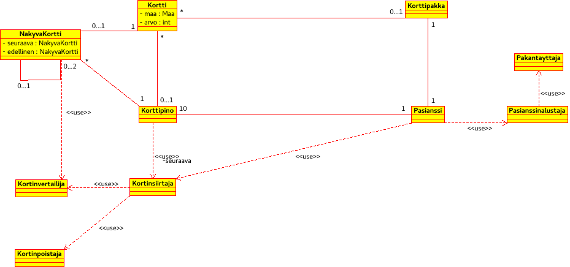
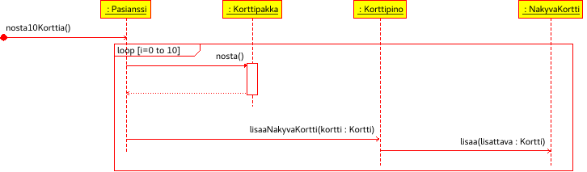
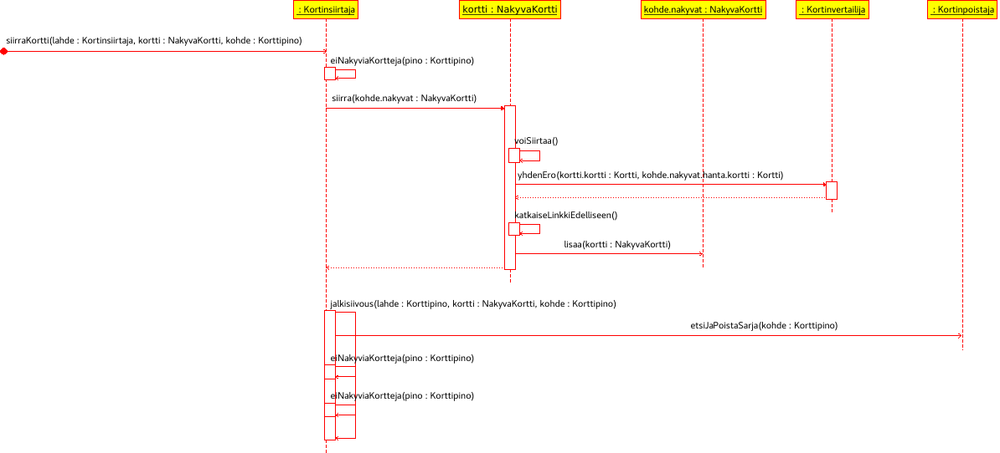

**Aihe:** Toteutetaan Spider-pasianssi. Pelin tavoitteena on tyhjentää pöytä korteista järjestämällä niitä maittain suuruusjärjestyksiin.

**Alkutilanne:**
- pelilaudalla on kymmenen pinoa kortteja
	- yhteensä 54 korttia, 5-6 korttia/pino
	- pinoista vain päälimmäisen kuvapuoli ylöspäin
- pelilaudalla on pakka
	- loput 50 korttia

**Pelaajan toiminnot:**
- kortin siirtäminen
	- vain pinon päälimmäistä korttia voi siirtää
	- kortin voi siirtää vain arvoltaan suuremman kortin päälle
	- useampaa kuin yhtä korttia voi siirtää kerralla vain jos ne ovat samaa maata ja suuruusjärjestyksessä
- korttien nostaminen pakasta
	- jos pakassa on kortteja, pelaaja voi milloin tahansa nostaa pakasta kymmenen korttia, yhden jokaiseen pinoon

**Pelin kulku:**
- jos saman maan kortit järjestetään suuruusjärjestykseen (kuningas alimmaisena, ässä päälimmäisenä), ne poistuvat pöydältä
- jos pinosta poistetaan kortit, joiden kuvapuoli on näkyvissä, pinon päälimmäinen kortti käännetään näkyviin

**Lopputilanne:**
- voitto
	- pinoissa ja pakassa ei enää yhtään korttia
- häviö
	- pelaaja ei pysty siirtämään yhtään korttia tai nostamaan niitä lisää pakasta
	- pelaajalle mahdollisilla siirroilla ei ole mahdollista tyhjentää pöytää korteista

[Luokkarakenne](luokkarakenne.md)
